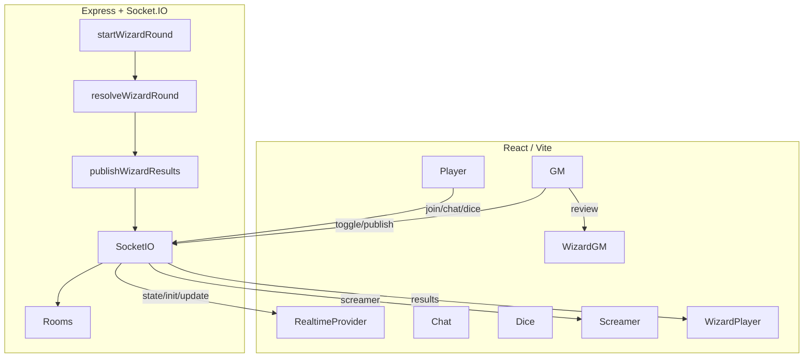
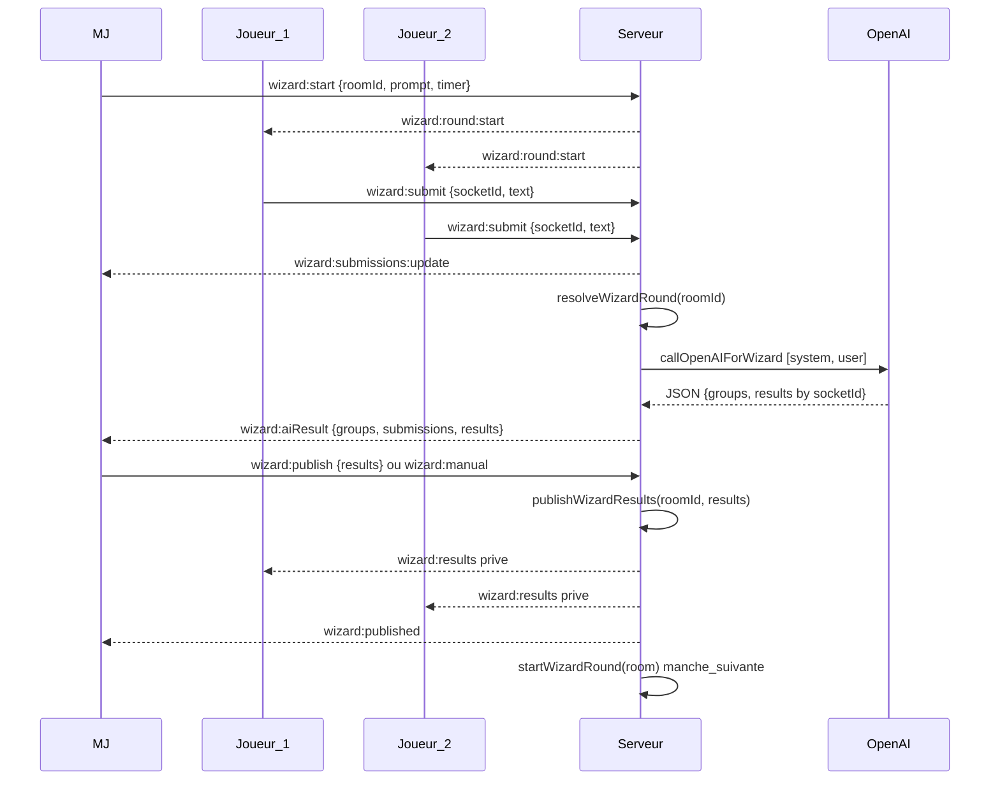

<div align="center">
  
  <br/>
  
  
  
  
  <!-- Optionnel: pipeline CI, licence, release
  /clainjo-horror/ci.yml?label=CI&style=flat-square" />
  
  -->
</div>

# Clainjo Horror


- **Frontend** : React + Vite (mobile-first pour Joueurs)
- **Realtime** : Socket.IO (client/serveur)
- **Backend** : Express + Socket.IO
- **IA** : OpenAI Responses API pour arbitrer le Wizard Battle
- **PWA** : Installable comme app native (Android/iOS/Desktop)
- **UX** : sobre, lisible, "brutal" quand il faut

---

## Sommaire

- [Aperçu](#aperçu)
- [Fonctionnalités](#fonctionnalités)
- [Fonctionnalités détaillées](#fonctionnalités-détaillées)
- [PWA - Progressive Web App](#pwa---progressive-web-app)
- [Démarrage rapide](#démarrage-rapide)
- [Docker (prod-like)](#docker-prod-like)
- [Configuration](#configuration)
- [Typographie](#typographie)
- [Architecture](#architecture)
- [Captures](#captures)
- [Roadmap](#roadmap)
- [Licence](#licence)

---

## Aperçu

**Clainjo Horror** mêle chat instantané, jets de dés équitables (côté serveur), screamers audio/visuels/haptiques et un **Wizard Battle** où l’IA classe les sorts des joueurs selon cohérence, originalité, vitesse et interactions élémentaires.  
MJ desktop confortable, Joueurs mobile-first.

---

## Fonctionnalités

- **Chat spectral** : diffusion instantanée par room, sobriété, lisibilité.
- **Jets autoritatifs** : serveur = source de vérité, modificateurs appliqués côté serveur.
- **Indices (bonus/malus + contenu à usage unique)** : 
  - Bonus/Malus consommés sur le prochain jet.
  - Indices “contenu” (texte/image/PDF) consultables une seule fois via une modale.
- **Screamers** : overlay plein écran, son + image + vibration (courbe haptique).
- **Haptique ciblée** : démarrage/arrêt d’un motif “battement” sur appareils compatibles.
- **Wizard Battle** : saisie libre, arbitrage IA → JSON strict, révision MJ → publication.
- **Présence & fiches** : PV, inventaire, monnaie, caractéristiques, compétences.
- **Layouts** : Joueurs = 1 colonne nette ; MJ = grille 2 colonnes ≥ 1024px.

## Fonctionnalités détaillées

### Chat
- __Ce que c’est__
  Messages temps-réel par salle (`roomId`). Support du broadcast (tous) et des messages ciblés.
- __Comment ça marche__
  Événement `chat:message` via Socket.IO. Stockage léger côté client.

### Jets de dés (serveur autoritaire)
- __Ce que c’est__
  Les jets sont générés sur le serveur et diffusés à tous, avec historique limité.
- __Comment ça marche__
  Événement `dice:roll` → calcul serveur → `dice:result`. Si un modificateur est en file (bonus/malus), il est consommé sur ce jet.

### Indices (bonus/malus + contenu à usage unique)
- __Ce que c’est__
  Deux familles d’indices :
  1) Modificateurs de dés (bonus/malus) consommés au prochain jet.
  2) Indices “contenu” (texte/image/PDF) consultables une seule fois.
- __Comment ça marche__
  - Côté MJ (`GMControls`):
    - Mode "Modificateur" → choisir bonus/malus, valeur, durée de la bulle → Envoyer.
    - Mode "Contenu" → choisir format (texte/image/PDF), saisir le texte ou l’URL → Envoyer.
  - Côté Joueur:
    - Une bulle apparaît.
      - Bulle "?" = modificateur → clic = `hint:claim` (file d’attente de modificateurs côté serveur).
      - Bulle "i" = contenu → clic = `hint:open` (le serveur renvoie `hint:content` une seule fois et supprime l’indice).
    - La modale d’indice se ferme via le bouton "Fermer" ou Échap et ne peut pas être rouverte.
- __Limites__
  Impossible de rouvrir côté app (l’état serveur est effacé). Les captures d’écran restent techniquement possibles (limite inhérente au web).

### Screamers
- __Ce que c’est__
  Un overlay plein écran, option image + son, intensité réglable, vibration si dispo.
- __Comment ça marche__
  Événement `screamer:send` (MJ → joueurs). Certains événements déclenchent des screamers automatiques (ex: critique sur d20). 

### Haptique ciblée
- __Ce que c’est__
  Le MJ peut déclencher un motif haptique (battements) sur certains joueurs.
- __Comment ça marche__
  `haptics:start` et `haptics:stop` avec pattern sécurisé et BPM encadré (≈50–160).

### Présence & fiches
- __Ce que c’est__
  Liste des joueurs et fiches (PV, inventaire, argent, stats, compétences). MJ peut éditer les fiches des joueurs.
- __Comment ça marche__
  Synchronisation via `presence:update`. Les verrous d’objets/compétences sont respectés côté serveur.

### Wizard Battle (arbitrage IA)
- __Ce que c’est__
  Manche par manche, les joueurs soumettent un sort, l’IA produit un classement et un résumé. Le MJ peut publier ou corriger.
- __Comment ça marche__
  `wizard:toggle`/`wizard:submit`/`wizard:publish`… Appel OpenAI côté serveur via modèle configurable, format JSON strict avec validations et stratégies de repli (manuel, retry).

### Assets de contenu (PDF/Images pour les indices)
- __Ce que c’est__
  Hébergement simple des fichiers d’indice.
- __Comment ça marche__
  Placez vos fichiers dans le dossier `public/` (ex: `public/hints/plan.pdf`) et utilisez l’URL `/hints/plan.pdf` dans le panneau MJ (mode "Contenu").

---

## PWA - Progressive Web App

**Clainjo Horror est maintenant une PWA complète**, installable comme une application native sur Android, iOS et Desktop.

### ✨ Fonctionnalités PWA

- 📱 **Installation native** : WebAPK sur Android, mode standalone sur iOS/Desktop
- 💾 **Fonctionne hors ligne** : Service Worker avec cache intelligent
- 🔄 **Mises à jour automatiques** : Notification utilisateur + activation immédiate
- 🎨 **Expérience native** : Plein écran, icône sur l'écran d'accueil, splash screen
- 🔗 **Liens profonds** : Les liens du domaine ouvrent directement l'app (Android)

### 🚀 Installation rapide PWA

```bash
# Générer les icônes placeholder
npm run generate-placeholder-icons

# Configurer votre domaine dans public/.well-known/assetlinks.json
# Build et test
npm run build
npm start
```

### 📚 Documentation PWA

- **[PWA_QUICKSTART.md](./PWA_QUICKSTART.md)** - Guide de démarrage rapide (5 min)
- **[PWA_README.md](./PWA_README.md)** - Vue d'ensemble et structure
- **[PWA_SETUP.md](./PWA_SETUP.md)** - Documentation complète
- **[WEBAPK_FLOW.md](./WEBAPK_FLOW.md)** - Flux Chrome → WebAPK Android

---

## Démarrage rapide

```bash
git clone https://github.com/<you>/clainjo-horror.git
cd clainjo-horror
npm install

# 1) Front (dev)
npm run dev

# 2) Serveur realtime
npm run server

# 3) Tout en parallèle
npm run dev:all
````

> \[!TIP]
> Tests manuels : ouvre 2 navigateurs (ou fenêtre privée) pour simuler MJ + Joueur, vérifie join/chat/dice/screamer.

---

## Docker (prod-like)

```bash
# Créez .env à la racine (voir Configuration)
docker compose up -d --build --remove-orphans
```

---

## Configuration

```env
OPENAI_API_KEY=sk-...          # Requis pour Wizard Battle
OPENAI_MODEL=gpt-4.1-nano      # Optionnel (défaut)
APP_VERSION=2025-09-21         # Optionnel, visible clients
# PORT/HOST_PORT via docker-compose.yml
```

> \[!NOTE]
> Réglages fins (intensités, tailles d’historique, délais IA…) : `DOCUMENTATION.md`.

> \[!TIP]
> Fichiers d’indices: placez images/PDF dans `public/` (ex: `public/hints/indice.jpg`) et référez-les dans le panneau MJ via `/hints/indice.jpg`.

## Typographie

- **Hamstrong** pour les titres (`h1`, `h2`, `h3`).
- Chargée depuis `src/assets/fonts/` et appliquée globalement via CSS.
- Permet un rendu “horreur” net tout en gardant la lecture claire sur mobile.

---

## Architecture

**Flux applicatif**



**Déroulé Wizard (séquentiel)**



---

## Captures

<div align="center">
  <!-- Remplace par tes images réelles -->
  
  
  
</div>

---

## Roadmap

* [ ] Effets de scène synchronisés (brouillard, battements, lumières connectées)
* [ ] Persistance base (historiques, profils)
* [ ] Thèmes alternatifs (noir/bleu froid, pellicule, found footage)
* [ ] Mode tournoi Wizard (tableaux, éliminations)

---

## Licence

Voir `LICENSE`. Si vous entendez des rires dans les logs, ne vous retournez pas.

```

---

### Ce que ça améliore concrètement

- **Hiérarchie visuelle** nette (titres, séparateurs, sommaire simple).
- **Badges harmonisés** (tons neutres/froids, cohérents).
- **Sections repliables** via admonitions GitHub (`> [!TIP]`, `> [!NOTE]`).
- **Deux Mermaid** stables (un par bloc, pas de `<br/>` ni parenthèses à risque).
- **Placeholders** propres pour screenshots (grid 3 colonnes).
- **Commandes** minimales et lisibles.

### Options bonus (si tu veux pousser)

- Ajoute un **banner** sombre en haut (`/docs/banner-dark.png`) et remplace le premier badge par l’image.
- Ajoute un badge **version** auto (`APP_VERSION`) avec GitHub Actions (release tag → shields).
- Table **“raccourcis MJ”** (commandes, hotkeys) dans `DOCUMENTATION.md`, linkée depuis le README.
- Ajoute un **GIF** court (5–8 s) “Wizard Battle” dans la section Captures.

---

### Pas à pas
1) Remplace ton README par le bloc proposé.  
2) Vérifie le rendu Mermaid sur GitHub (ou avec `npx @mermaid-js/mermaid-cli`).  
3) Ajoute 3 captures réelles dans `docs/img/` et corrige leurs chemins.  
4) Optionnel : ajoute badges CI/licence si tu as les workflows.
```
